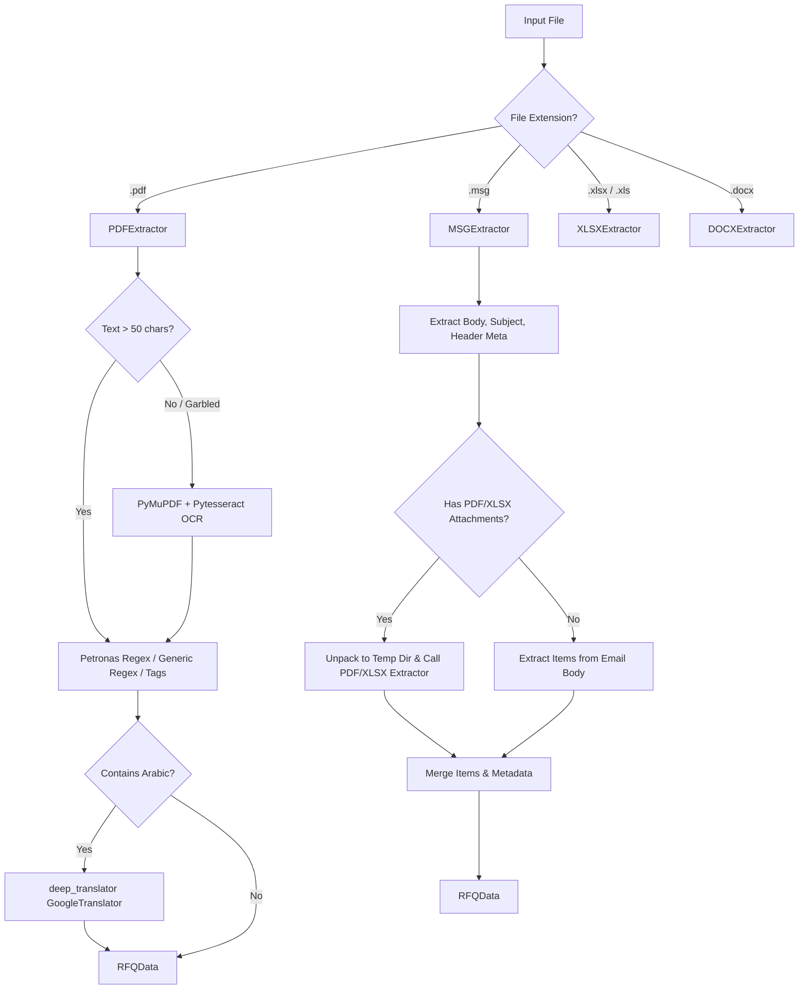
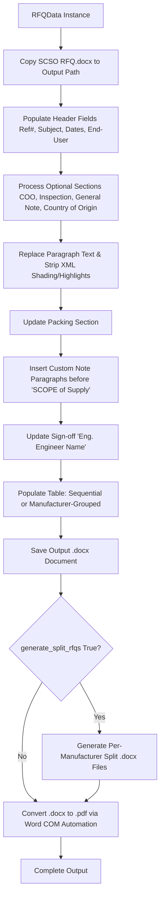

# Project Context & Technical Architecture Manual: SCSO RFQ Tool

> **Target Audience**: AI Language Models, Technical Architects, and Developers.
> **Purpose**: This document provides a comprehensive, end-to-end technical reference for the SCSO RFQ Tool codebase. It explains the software domain, design decisions, data models, file parsing algorithms, document generation engine, GUI wizard workflow, build procedures, and runtime workarounds.

---

## 1. Executive Summary & Business Domain

The **SCSO RFQ Automation Tool** is a specialized desktop application built for SCSO (procurement & engineering operations). 

### The Problem
Clients and end-users (e.g., Petronas, Majnoon oil field operators, Alsharq) submit Requests for Quotations (RFQs) and technical inquiries in highly heterogeneous formats:
- Email bodies (`.msg`) containing informal product specifications.
- Formal PDF documents (both native vector PDFs and scanned image-based PDFs).
- Excel sheets (`.xlsx`, `.xls`) with variable column headers in English and Arabic.
- Word documents (`.docx`).

Manually extracting inquiry line items, technical attributes, closing dates, tender numbers, and customer details, then re-keying them into SCSO's official Word template (`SCSO RFQ.docx`) and converting to PDF is labor-intensive and prone to human error.

### The Solution
The SCSO RFQ Tool automates this pipeline:
1. **Ingests & Extracts**: Parses incoming files, detects format-specific structures, runs OCR on scanned documents, and translates Arabic inquiries to English with human-in-the-loop validation.
2. **Standardizes**: Normalizes line items, quantities, manufacturers, model numbers, part numbers, closing dates, and tender metadata into a unified Python data model (`RFQData`).
3. **Interacts**: Presents an interactive 3-step GUI wizard for human review, editing, toggle control over legal/technical clauses, custom note addition, and date selection.
4. **Generates & Converts**: Populates the master `.docx` template, formats line items sequentially or grouped by brand, creates split RFQs per manufacturer if requested, and converts output files to high-fidelity PDF documents using Word COM automation.

---

## 2. System Architecture & Directory Layout

```
Program/
├── .gitignore               # Excludes build artifacts, virtualenvs, local settings, output docs
├── README.md                # General project overview & setup guide
├── PROJECT_CONTEXT.md       # (This file) Deep architectural context for LLMs
└── scso_rfq_tool/           # Main Python application package
    ├── main.py              # App entry point & PyInstaller win32com path fix
    ├── build.spec           # PyInstaller single-folder build specification
    ├── installer.iss        # Inno Setup script for Windows installer (.exe)
    ├── requirements.txt     # Python dependencies
    ├── config/
    │   ├── __init__.py
    │   └── settings.py      # User settings persistence & template locator
    ├── models/
    │   ├── __init__.py
    │   └── rfq_data.py      # Core data models: RFQItem & RFQData
    ├── extractors/          # Extractor Strategy Subsystem
    │   ├── __init__.py
    │   ├── base.py          # Abstract Base Class for extractors
    │   ├── docx_extractor.py # Word document parser
    │   ├── msg_extractor.py  # Outlook email & attachment parser
    │   ├── pdf_extractor.py  # PDF text/OCR/translation/regex parser
    │   └── xlsx_extractor.py # Excel table auto-detection parser
    ├── processors/
    │   ├── __init__.py
    │   └── rfq_builder.py   # Document builder & Word COM PDF converter
    ├── gui/
    │   ├── __init__.py
    │   └── app.py           # Tkinter Desktop GUI (3-screen wizard & dialogs)
    └── resources/
        └── SCSO RFQ.docx    # Official master Word template
```

---

## 3. Data Models (`models/rfq_data.py`)

The application state revolves around two dataclasses in `models/rfq_data.py`:

```python
@dataclass
class RFQItem:
    index: int = 0
    description: str = ""
    quantity: str = ""
    manufacturer: Optional[str] = None
    model: Optional[str] = None
    part_number: Optional[str] = None
```

```python
@dataclass
class RFQData:
    # Header fields
    ref_number: str = ""                # Internal SCSO reference number (e.g. "4783")
    tender_subject: str = ""            # Short tender description / title
    closing_date: str = ""              # Date string (e.g. "2026.07.30")

    # Optional header fields
    end_user: str = ""
    end_user_address: str = ""
    tender_number: str = ""             # External tender / RFQ number
    project_name: str = ""

    # Line items
    items: List[RFQItem] = field(default_factory=list)

    # Footer / Sign-off
    engineer_name: str = ""

    # Tender requirement toggles
    delivery_terms: str = "Ex-Work, FOB, FCA."
    include_coo_requirement_line: bool = True
    include_inspection_requirement_line: bool = True
    include_end_user: bool = False
    include_end_user_address: bool = False
    include_tender_number: bool = False
    include_project_name: bool = False

    # Packing section
    packing_header: str = "Packing Requirements"
    packing_text: str = "As per manufacturer standards."
    packing_detail: str = "Please inform us of the estimated weight and Packing details..."

    # Optional body sections
    include_inspection_section: bool = True
    include_coo_section: bool = True
    include_general_note: bool = True
    include_country_of_origin: bool = False

    # Dynamic section texts (customizable per project or global default)
    coo_requirement_text: str = "Certificate of Origin is required, as shown below."
    inspection_requirement_text: str = "3rd party inspection is required as shown below."
    inspection_section_text: str = "..."
    coo_section_text: str = "..."
    general_note_text: str = "..."
    country_of_origin_text: str = "..."

    # Custom note paragraphs inserted before SCOPE of Supply
    custom_notes: List[str] = field(default_factory=list)

    # Output options
    generate_split_rfqs: bool = False
    output_folder: str = ""
    output_filename: str = ""           # e.g., "Request #4783 Coriolis flowmeter"

    # Source tracking & raw text
    source_file_path: str = ""
    raw_extracted_text: str = ""        # For live inspection / fallback manual entry
```

---

## 4. Configuration & Settings Subsystem (`config/settings.py`)

- **Storage Location**: `~/.scso_rfq_tool/settings.json`
- **Atomic File Writes**: `save_settings()` writes to a `.tmp` file first, then uses `os.rename()` to overwrite `settings.json`, preventing data corruption if app closes mid-write.
- **Default Values**: Stores default values for `engineer_names` list, `default_delivery_terms`, and default texts for all template sections (COO, 3rd Party Inspection, General Note, Country of Origin, Packing).
- **MRU Engineer List**: `add_engineer_name()` moves the most recently used engineer name to index 0 of the saved list.
- **Template Discovery**: `get_template_path()` resolves `resources/SCSO RFQ.docx` both when running from Python source and when packaged in PyInstaller bundle (`sys.frozen` context next to `sys.executable`).

---

## 5. File Extraction Subsystem (`extractors/`)

All extractors inherit from `BaseExtractor` (`extractors/base.py`) which mandates `can_handle(file_path: str) -> bool` and `extract(file_path: str) -> RFQData`.



### 5.1 `pdf_extractor.py` (PDFExtractor)
- **Text Extraction**: Uses `pdfplumber`. If text length is < 50 characters or text character ratio is garbled (`_is_text_garbage()`), triggers OCR.
- **OCR Pipeline**: Renders PDF pages to 300 DPI PNG pixmaps using `PyMuPDF` (`fitz`), then invokes `pytesseract` image-to-string (`eng+ara` language models).
- **Arabic Translation**: Scans for Unicode Arabic range `[\u0600-\u06FF\u0750-\u077F\u08A0-\u08FF]+`. If present (> 20 chars), splits text into 4500-char chunks and translates using `deep_translator.GoogleTranslator`. Prefixes raw extracted text with translation notice so user can review it in GUI.
- **Petronas Structured Parser**: Scans for Petronas RFx material format:
  - Header: `RFQ NUMBER : <number>`
  - Line items regex: `^\s*(\d+)\s+(\d{8})\s+([\d,.]+)\s+([A-Z]{2})\s+(.+)$`
  - Attributes parsing: `MANUFACTURER NAME`, `MODEL NUMBER`, `MANUFACTURER PART NUMBER`.
- **Generic Parsers**:
  - Numbered list regex: `(\d+)\.\s+(.+?)(?:Qty|QTY|Quantity|qty)\s*[:\-]?\s*(\d+)`
  - Tag number matcher: Searches for tag numbers like `CP2-506FT-001` or `CP2-506FT -001` and creates datasheet line items.
- **Metadata Parsers**: Extracts closing dates and tender subjects using regex patterns.

### 5.2 `msg_extractor.py` (MSGExtractor)
- **Email Body Parsing**: Uses `extract-msg` library to parse `.msg` files.
- **Metadata Extraction**: Scans email body for patterns like `NO later than <date>`, `before <date>`, `Closing Date: <date>`, `Tender Title: <subject>`, `Tender No.: <no>`, `client <name>`.
- **Alsharq-Style Inquiries**: Parses direct body requests where product descriptions appear before `Qty: N`.
- **Attachment Unpacking**: Extracts attachment files (`.pdf`, `.xlsx`, `.docx`) to temporary directory (`tempfile.mkdtemp()`), recursively invokes `PDFExtractor` or `XLSXExtractor`, merges items and metadata into `RFQData`, and cleans up temp folder in `finally:` block.

### 5.3 `xlsx_extractor.py` (XLSXExtractor)
- **Header Auto-Detection**: Scans first 20 rows using `openpyxl`. Matches column headers against multi-lingual pattern tuples:
  - Description: `("description", "item description", "material", "product", "scope")`
  - Quantity: `("qty", "quantity", "qnty", "amount", "الكمية")`
  - Manufacturer: `("manufacturer", "mfg", "brand", "make", "المصنع")`
  - Model: `("model", "model number", "model no", "الموديل")`
  - Part Number: `("part number", "part no", "p/n", "pn", "رقم القطعة")`
- **Fallback**: If no header row is identified, dumps raw non-empty cell values to `raw_extracted_text`.

### 5.4 `docx_extractor.py` (DOCXExtractor)
- Uses `python-docx` to extract text paragraphs and table cell contents.

---

## 6. Document Generation & PDF Conversion Engine (`processors/rfq_builder.py`)

`RFQBuilder` takes an `RFQData` instance, clones the master `resources/SCSO RFQ.docx` template, and performs XML and paragraph manipulation:



### Key Technical Details of `RFQBuilder`
1. **Header Paragraph Replacement**: Searches document paragraphs for exact prefixes (`Quotation Request:`, `Tender Subject:`, `Delivery price`, `Closing Date:`, `End-User:`, `Tender Number:`, `Project Name:`). Updates paragraph text while preserving font properties of the original run. If an optional header (like End-User or Tender Number) is disabled, removes the paragraph element via XML parent node manipulation (`parent.remove(p._element)`).
2. **Multi-line Section Replacement**: To support user-edited, multi-line section texts without leaving leftover highlight colors or background shading from the template:
   - Clears paragraph text (`paragraph.text = ""`).
   - Clears paragraph-level shading XML elements (`w:shd`) from `pPr`.
   - Inserts the header line in bold `Cambria 11pt`.
   - Appends subsequent lines as sibling paragraph elements (`OxmlElement('w:p')`) styled in `Calibri 11pt`.
3. **Table Population & Formatting**:
   - Clears all placeholder rows from the template table after the header row.
   - For standard RFQs, appends rows with item index, description, and quantity.
   - For manufacturer-grouped RFQs, groups items by brand and consolidates descriptions and quantities with newline separators.
   - Applies strict font formatting (`Calibri 10pt`) across all added cell runs (`_apply_cell_font()`).
4. **Manufacturer-Split RFQs**: If `generate_split_rfqs` is enabled, groups items by `item.manufacturer`, clones the populated general `.docx`, filters the table to only items belonging to that manufacturer, updates the tender subject header (e.g. `Tender Subject - BrandName`), and saves separate `.docx` and `.pdf` files.
5. **High-Fidelity PDF Conversion**:
   - Uses Microsoft Word COM Automation (`win32com.client`).
   - Uses dynamic dispatch (`win32com.client.dynamic.Dispatch("Word.Application")`) to avoid PyInstaller `gen_py` cache lookup crashes under packaged executable runs.
   - Runs Word headlessly (`Visible = False`, `DisplayAlerts = 0`), calls `doc.SaveAs(abs_pdf, FileFormat=17)`, and guarantees document & application closure in a `finally:` block.

---

## 7. Desktop GUI Architecture (`gui/app.py`)

The user interface is built using Python's `tkinter` and `ttk` libraries, styled with an industrial slate/steel/copper design palette.

### 7.1 Wizard Navigation Flow
- **Screen 1: File Selection (`_build_file_screen`)**:
  - Drag-and-drop file target & file picker button (`.msg`, `.pdf`, `.xlsx`, `.docx`).
  - Batch queue Treeview with drag-to-reorder, item removal, and clear all.
  - Process Inquiries button launching background extraction thread.
- **Screen 2: Review & Edit Form (`_build_review_screen`)**:
  - Two-column scrollable form layout.
  - **Header & Meta**: Ref #, Tender Subject, Closing Date (with `tkcalendar` interactive popup picker fallback to text entry), Engineer Name (dropdown loaded from `settings.json`), Delivery Terms.
  - **Optional Toggles**: Checkboxes for End-User, Tender #, Project Name, COO line/section, Inspection line/section, General Note, Country of Origin.
  - **Editable Sections**: ScrolledText widgets pre-filled with global default section texts, enabling single-inquiry overrides.
  - **Line Items Table**: Interactive Treeview showing Index, Description, Qty, Manufacturer. Buttons to Add, Edit (via `ItemDialog` popup), Delete, Move Up, Move Down, Clear All.
  - **Custom Notes Manager**: Add, edit, or remove extra paragraphs inserted before `SCOPE of Supply:`.
  - **Output Settings**: Split RFQs checkbox, output folder browser, output filename entry.
  - **Raw Text Preview**: Collapsible ScrolledText pane showing raw extracted text for reference or copying.
- **Screen 3: Progress & Completion (`_build_progress_screen`)**:
  - Progress bar and live log window.
  - Launches `RFQBuilder` on a separate worker thread (`threading.Thread`) so the GUI main loop remains responsive.
  - "Open Output Folder" button upon completion.

### 7.2 Auxiliary Dialogs
- `ItemDialog`: Modal pop-up to add or edit an `RFQItem` (description, quantity, manufacturer).
- `TranslationApprovalDialog`: Split-view modal displaying original Arabic text on the left and editable English translation on the right, prompting user approval before populating the form.
- `SettingsDialog`: Global configuration window allowing users to edit saved engineer names, default delivery terms, and master default texts for all template clauses.

---

## 8. Build, Packaging & Distribution (`build.spec` & `installer.iss`)

### 8.1 Entry Point Workaround (`main.py`)
When packaged with PyInstaller, `win32com` can fail or crash due to permission issues when attempting to write compiled typelib caches to a read-only `gen_py` directory. `main.py` explicitly handles this before importing GUI or COM modules:

```python
if hasattr(sys, '_MEIPASS'):
    import tempfile
    import win32com
    win32com.__gen_path__ = os.path.join(
        tempfile.gettempdir(),
        f"gen_py_{sys.version_info.major}_{sys.version_info.minor}"
    )
    os.makedirs(win32com.__gen_path__, exist_ok=True)
```

### 8.2 PyInstaller Build Spec (`build.spec`)
- Configured for **one-folder distribution** (`dist/SCSO_RFQ_Tool/`).
- **Binary Bundling**: Dynamically locates `pywin32_system32` DLLs (`pythoncom312.dll`, `pywintypes312.dll`) and bundles them into root distribution directory to prevent COM DLL loading failures on target machines.
- **Resource Bundling**: Bundles `resources/SCSO RFQ.docx`.
- **Hidden Imports**: Explicitly lists dynamic imports (`pdfplumber`, `extract_msg`, `docx`, `openpyxl`, `fitz`, `PIL`, `deep_translator`, `tkcalendar`, `babel`, `docx2pdf`, `win32com`).
- **Excludes**: Excludes unused heavy data science modules (`matplotlib`, `numpy`, `scipy`, `pandas`, `pytest`) to keep distribution binary size under 50 MB.

### 8.3 Inno Setup Installer (`installer.iss`)
- Packages `dist/SCSO_RFQ_Tool/*` into a single standalone installer (`SCSO_RFQ_Tool_Setup_v1.0.0.exe`).
- Installs to `{autopf}\SCSO RFQ Tool`.
- Creates Desktop & Start Menu shortcuts.
- Configures clean Windows Uninstaller registration.

---

## 9. Key Dependencies & Libraries

| Dependency | Version Requirement | Purpose in SCSO RFQ Tool |
| :--- | :--- | :--- |
| `python-docx` | `>= 0.8.11` | Template parsing, table population, XML paragraph editing |
| `pdfplumber` | `>= 0.10.0` | High-accuracy text extraction from vector PDFs |
| `PyMuPDF` (`fitz`) | `>= 1.23.0` | PDF page rendering to high-DPI images for OCR |
| `pytesseract` | `>= 0.3.10` | Tesseract OCR engine wrapper for scanned PDFs |
| `extract-msg` | `>= 0.45.0` | Outlook `.msg` email format parsing & attachment extraction |
| `openpyxl` | `>= 3.1.0` | Excel `.xlsx` / `.xls` spreadsheet reading & cell mapping |
| `deep-translator` | `>= 1.11.0` | Google Translate API wrapper for Arabic-to-English inquiries |
| `Pillow` (`PIL`) | `>= 10.0.0` | Image processing for OCR pixmaps |
| `pyinstaller` | `>= 6.0.0` | Packaging Python application into standalone executable |
| `pywin32` | *(bundled)* | Windows COM interface for Microsoft Word PDF export |
| `tkcalendar` | *(optional)* | GUI calendar widget for interactive date picking |

---

## 10. Maintenance & Developer Extension Guidelines

### Adding a New Extractor Format (e.g., CSV or HTML)
1. Create a new file in `extractors/` (e.g. `csv_extractor.py`) inheriting from `BaseExtractor`.
2. Implement `can_handle(file_path: str) -> bool` and `extract(file_path: str) -> RFQData`.
3. Import and add your extractor class to `MSGExtractor` attachment processing and `gui/app.py` file types.

### Updating Template Clause Layouts
- Modify master template `resources/SCSO RFQ.docx`.
- If paragraph markers or heading text prefixes change, update corresponding constant prefixes in `processors/rfq_builder.py` (`_populate_header()`, `_process_body_section()`).

---

*Document Version: 1.0.0 — SCSO RFQ Automation Tool Engineering Specification.*
