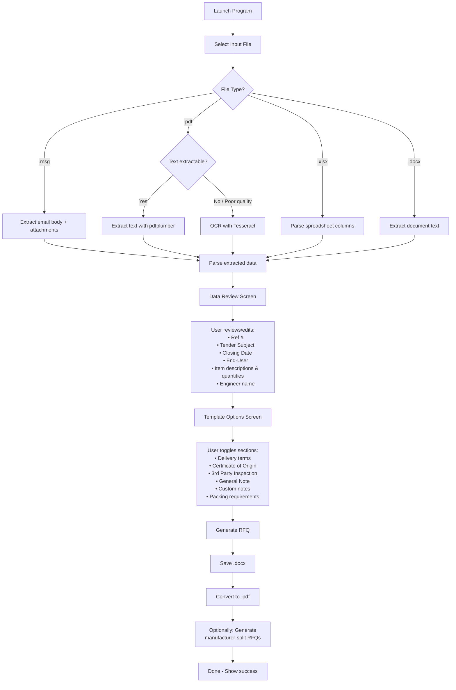

# SCSO RFQ Automation Program — Implementation Plan

## Problem Statement

Sales engineers at SCSO receive daily procurement inquiries from end-users (oil & gas field clients). Each inquiry arrives in different formats (Outlook `.msg` emails, `.pdf` files, `.xlsx` spreadsheets, `.docx` documents) and must be manually translated into a standardized RFQ document using the company's [SCSO RFQ.docx](file:///c:/Users/asus/Documents/AUIS/Summer%202026/ENGR%20490/Program/Mohammed%20Raaed/SCSO%20RFQ.docx) template. This is tedious, repetitive, and error-prone. The program will automate this process.

## Analysis of the RFQ Template

After thorough analysis of the template and **4 completed real-world RFQ examples**, here is the full map of every field in the template and how it varies across inquiries:

### Template Fields (Paragraphs)

| # | Template Text | Behavior | Source |
|---|---|---|---|
| P0 | `Quotation Request: Ref. # SCSO` | **Always edited** — `SCSO` replaced with the internal Request # (e.g., `4783`, `4808`, `4635`, `4764`) | User input |
| P1 | `Tender Subject: XXXXXX` | **Always edited** — replaced with a short subject description (e.g., `Coriolis flowmeter`, `Ultrasonic Level Switch`, `Supply of Operational Spares Parts (RFQ: 6300046293)`) | Extracted from inquiry + user confirmation |
| P9 | `Delivery price Ex-Work, FOB, FCA.` | **Sometimes simplified** — Some RFQs keep `FOB, FCA`, others trim to just `Ex-Work` | User choice |
| P10 | `Certificate of Origin is required, as shown below.` | **Sometimes kept, sometimes removed**, sometimes reworded to `Certificate of Origin is Required.` | User choice |
| P11 | `3rd party inspection is required as shown below.` | **Sometimes removed entirely** | User choice |
| P12 | `Closing Date: 2025.XX.XX.` | **Always edited** — Date filled in from inquiry (format `YYYY.MM.DD` or `DD.MM.YYYY` or `ASAP`) | Extracted from inquiry |
| P13 | `End-User:` | **Sometimes filled** (e.g., `BOC- Majnoon Oil Field`), **sometimes removed** | Extracted or user input |
| P14 | `End-User Address:` | **Sometimes filled, sometimes removed** | User input |
| P15 | `Tender Number:` | **Sometimes filled, sometimes removed** | Extracted or user input |
| P16 | `Project Name:` | **Sometimes filled, sometimes removed** | User input |
| P21–P23 | Packing Requirements section | **Sometimes kept as-is, sometimes reworded** (e.g., `Manufacturer Standard Packing.` or `The packing method should be: Fiber board.`) | User choice |
| P24–P30 | 3rd Party Inspection section | **Sometimes kept, sometimes removed entirely** | User choice |
| P31–P32 | Certificate of Origin section | **Sometimes kept, sometimes removed entirely** | User choice |
| P36–P37 | General Note section | **Sometimes kept, sometimes removed entirely** | User choice |
| P40 | `Thank You and Best Regards` | **Always kept** | Static |
| P41 | `Eng.` | **Always edited** — Engineer's full name added (e.g., `Eng. Mohammed Aljanabi`, `Eng. Bashaaer Al-Neama`) | User input |

### Additional Paragraphs (Added in some RFQs, not in template)

Some completed RFQs contain **extra paragraphs not in the template** that were added manually by the engineer:

- **Custom notes**: e.g., `We need your support to have list of all recommended spares for these FTs with ordering code/part number reference.` (Majnoon)
- **Custom notes**: e.g., `Kindly check the attached data sheet for general notes.` (Majnoon)
- **Country of Origin section**: with accepted countries list (ITP)
- **General Requirements section**: with bullet points for inspection certificates (ITP)

### Table (Scope of Supply)

| Column | Header | Content |
|--------|--------|---------|
| 0 | Item | Sequential number (01, 02... or 1, 2...) |
| 1 | Description | Product description — varies wildly by inquiry type |
| 2 | QTY | Quantity |

> [!IMPORTANT]
> The table structure varies significantly across inquiry types:
> - **Petronas**: Many items, grouped by manufacturer, with part numbers and model info in the description
> - **Majnoon**: 20 items each with tag number + `According to the attached data sheet`
> - **SCSO/Alsharq**: Single item with detailed specs inline
> - **ITP**: Single item with general description + reference to attached specs

---

## Analysis of Input Formats (4 Real Examples)

### 1. Petronas (Structured PDF + MSG email)
- **Input**: `.msg` email (invitation to bid) + `.pdf` (RFx Material Specification)
- **PDF type**: Text-extractable, structured tabular format
- **Language**: English
- **Data**: RFQ number, multiple items with product numbers, quantities, units, manufacturer names, model numbers, part numbers
- **Extra info from MSG**: Closing date (`NO later than 1 July 2026`), Tender Title
- **Output**: General RFQ + per-manufacturer split RFQs

### 2. ITP (Scanned Arabic PDF with drawing)
- **Input**: `.pdf` — **partially scanned/Arabic**, contains mixed Arabic and English text
- **PDF type**: Partially OCR-readable, mostly image-based, **Arabic language**
- **Language**: Arabic (needs translation)
- **Data**: Single item (`Spring for spindle local`), quantity (`1,000,000`), detailed engineering drawing with spring specs
- **Output**: Single RFQ with custom sections (Country of Origin, General Requirements)

### 3. Majnoon/Yokogawa (Technical datasheet PDF)
- **Input**: `.pdf` — 45-page Coriolis Flowmeter datasheet, correspondence `.msg` emails
- **PDF type**: Partially text-extractable, engineering datasheets
- **Language**: English
- **Data**: 20 flow transmitter tag numbers (CP2-506FT-001 etc.), qty 1 each
- **Output**: Single RFQ, simplified template (removed COO, inspection, general note sections)

### 4. SCSO/Alsharq (Email-only inquiry)
- **Input**: `.msg` email — product details entirely in the email body
- **PDF type**: N/A (no PDF)
- **Language**: English
- **Data**: Single item with full spec (model, manufacturer, material, process connection, etc.), qty 2, closing date April 30
- **Output**: Single RFQ, heavily simplified template

---

## User Review Required

> [!IMPORTANT]
> ### Key Design Decisions Needing Your Input
>
> The following are questions that emerged from analyzing the real-world data. I need your answers to finalize the plan.

### Q1: Manufacturer-Specific Split RFQs
The reference script generates **per-manufacturer split RFQs** (e.g., `Operational Spares - ENSTO.docx`). This only applies to Petronas-style multi-item inquiries. 
**Question**: Should the new program always offer the option to generate manufacturer-split RFQs, or is this only for Petronas-type inquiries? Is there a rule for when to do this?

### Q2: Request Reference Number
The `Ref. # XXXX` (e.g., `4783`, `4808`) appears to be an **internal SCSO number**, not extracted from the inquiry itself. 
**Question**: Is this number assigned manually by the engineer? Does the engineer type it in? Or is it auto-incremented from some counter?

### Q3: Engineer Name
The template ends with `Eng.` and the completed RFQs have the full name (e.g., `Eng. Mohammed Aljanabi`).
**Question**: Should the program ask for the engineer's name each time, or should it store a default name (configurable in settings)?

### Q4: PDF Output
You mentioned the program must produce both `.docx` and `.pdf` outputs.
**Question**: Should the PDF be a direct conversion of the `.docx`? Is it acceptable to use a library like `docx2pdf` (which requires Microsoft Word installed) or would you prefer a pure Python solution (which may have slight formatting differences)?

### Q5: OCR for Scanned PDFs
The ITP inquiry PDF is partially scanned (Arabic text as images).
**Question**: For scanned/image-based PDFs, should the program:
  - (a) Use OCR (Tesseract) to attempt text extraction, then let the user review/edit?
  - (b) Display the PDF pages as images in the UI so the user can read and manually type the data?
  - (c) Both — try OCR first, fallback to manual entry?

### Q6: Arabic → English Translation
The ITP inquiry contains Arabic text.
**Question**: Should the program attempt automatic translation (requires an API like Google Translate), or should the user handle the translation manually when they review the extracted data?

### Q7: Output Naming Convention
The completed RFQs follow patterns like:
- `Request #4783 Coriolis flowmeter.docx`
- `Request #4808 Spring for Spindle local.docx`
- `Request #4764 Supply of Operational Spares Parts.docx`

**Question**: Is the format always `Request #[Ref#] [TenderSubject].docx`? Should the program auto-generate this name?

### Q8: Output Location
**Question**: Should the output files be saved:
  - (a) In the same folder as the input inquiry?
  - (b) In a user-selected folder?
  - (c) In a fixed default output folder?

### Q9: Template Sections — Decision Logic
The template has several optional sections (3rd Party Inspection, Certificate of Origin, General Note). In the completed RFQs, these are kept or removed based on the inquiry context.
**Question**: Should the program:
  - (a) Show all sections with checkboxes to keep/remove each one?
  - (b) Try to auto-detect which to keep based on the inquiry, then let user confirm?
  - (c) Always include everything and let the user edit the final document manually?

### Q10: The `.xlsx` Inquiry Format
You mentioned `.xlsx` files as a possible input. The SCSO example has `Inquiry Preview.xlsx` as an attachment.
**Question**: Could you provide a sample `.xlsx` inquiry file or describe its typical structure? Is it a standard spreadsheet with product details in columns?

---

## Proposed Architecture

### Technology Stack

| Component | Technology | Reason |
|-----------|-----------|--------|
| Language | Python 3.11+ | Best ecosystem for document processing |
| GUI Framework | `tkinter` (built-in) | Simple, no extra dependencies, comes with Python |
| DOCX Processing | `python-docx` | Read/write Word documents |
| PDF Text Extraction | `pdfplumber` | Best for structured PDF text extraction |
| OCR (Scanned PDFs) | `pytesseract` + Pillow + `pdf2image` | Handle image-based PDFs |
| MSG Email Parsing | `extract-msg` | Read Outlook .msg files |
| XLSX Processing | `openpyxl` | Read Excel spreadsheets |
| PDF Output | `docx2pdf` (requires MS Word) | Best fidelity for DOCX→PDF conversion |
| Packaging | `PyInstaller` | Create standalone `.exe` — no Python needed on target PCs |

### Application Structure

```
scso_rfq_tool/
├── main.py                  # Entry point, launches GUI
├── gui/
│   ├── __init__.py
│   ├── app.py               # Main application window
│   ├── file_selector.py     # File selection dialog
│   ├── data_review.py       # Review/edit extracted data screen
│   ├── template_options.py  # Template section toggles screen
│   └── progress.py          # Progress/status display
├── extractors/
│   ├── __init__.py
│   ├── base.py              # Base extractor interface
│   ├── pdf_extractor.py     # Text-based PDF extraction
│   ├── ocr_extractor.py     # Image/scanned PDF extraction (OCR)
│   ├── msg_extractor.py     # Outlook .msg email extraction
│   ├── xlsx_extractor.py    # Excel spreadsheet extraction
│   └── docx_extractor.py    # Word document extraction
├── processors/
│   ├── __init__.py
│   ├── data_parser.py       # Parse raw text → structured items
│   └── rfq_builder.py       # Populate template, generate output
├── models/
│   ├── __init__.py
│   └── rfq_data.py          # Data classes for RFQ fields
├── config/
│   ├── __init__.py
│   └── settings.py          # User settings (engineer name, defaults)
├── resources/
│   └── SCSO RFQ.docx        # Bundled template
├── build.spec               # PyInstaller spec file
└── requirements.txt         # Python dependencies
```

---

## Proposed Workflow (User Flow)



---

## Detailed Implementation Plan

### Phase 1: Core Data Models & Extractors

#### [NEW] [rfq_data.py](file:///c:/Users/asus/Documents/AUIS/Summer%202026/ENGR%20490/Program/scso_rfq_tool/models/rfq_data.py)

Define dataclasses for all RFQ fields:

```python
@dataclass
class RFQItem:
    index: int
    description: str
    quantity: str
    manufacturer: Optional[str] = None
    model: Optional[str] = None
    part_number: Optional[str] = None

@dataclass 
class RFQData:
    ref_number: str                    # Internal SCSO ref (e.g., "4783")
    tender_subject: str                # Short description
    closing_date: str                  # Date string
    end_user: Optional[str]            # End user name
    end_user_address: Optional[str]    
    tender_number: Optional[str]       # External tender number
    project_name: Optional[str]
    items: List[RFQItem]
    engineer_name: str
    
    # Template section toggles
    delivery_terms: str                # "Ex-Work, FOB, FCA" or "Ex-Work" etc.
    include_coo_requirement: bool
    include_inspection_section: bool
    include_coo_section: bool
    include_general_note: bool
    packing_text: str                  # Custom packing text
    custom_notes: List[str]            # Extra paragraphs to insert
    
    # Manufacturer-split option
    generate_split_rfqs: bool
```

#### [NEW] Extractors (one per file type)

Each extractor will:
1. Read the file
2. Extract raw text/data
3. Attempt to parse structured fields (items, dates, names)
4. Return a partially-filled `RFQData` object for user review

**PDF Extractor** — Handles two sub-cases:
- Text-extractable PDFs (like Petronas RFx): Use `pdfplumber`, apply regex patterns from [process_rfqs.py](file:///c:/Users/asus/Documents/AUIS/Summer%202026/ENGR%20490/Program/Mohammed%20Raaed/process_rfqs.py) to extract items
- Scanned/image PDFs (like ITP): Use `pdf2image` to convert pages to images, run `pytesseract` OCR, then parse

**MSG Extractor** — Extracts:
- Email subject, body text, sender
- Attachments (saved temporarily for further processing)
- Parses closing dates, item descriptions, quantities from body text
- If attachments contain `.pdf`/`.xlsx`, chains to the appropriate extractor

**XLSX Extractor** — Reads spreadsheet, identifies columns for description, quantity, part number, etc.

**DOCX Extractor** — Extracts text content from Word documents.

---

### Phase 2: RFQ Builder (Template Population)

#### [NEW] [rfq_builder.py](file:///c:/Users/asus/Documents/AUIS/Summer%202026/ENGR%20490/Program/scso_rfq_tool/processors/rfq_builder.py)

Takes a complete `RFQData` object and the template, produces the output:

1. **Copy template** to output location
2. **Edit paragraph fields**: Ref #, Tender Subject, Closing Date, End-User, etc.
3. **Remove/keep optional sections** based on toggle flags
4. **Insert custom notes** where appropriate
5. **Clear and rebuild the table** with extracted items
6. **Set engineer name**
7. **Save as `.docx`**
8. **Convert to `.pdf`** using `docx2pdf`
9. **Optionally generate manufacturer-split RFQs** (per the Petronas pattern)

Key considerations from the reference script:
- Preserve formatting/runs when editing paragraphs (bold headers, etc.)
- Handle table row management (clear placeholder rows, add real data rows)
- Maintain font styling in table cells

---

### Phase 3: GUI (Tkinter)

#### Screen 1: File Selection
- **File browser button** — Opens native Windows file dialog
- Filter by `.msg`, `.pdf`, `.xlsx`, `.docx`
- Shows selected file path
- "Extract Data" button

#### Screen 2: Data Review & Edit
- **Scrollable form** with all RFQ fields pre-populated from extraction
- Editable text fields for: Ref #, Tender Subject, Closing Date, End-User, End-User Address, Tender Number, Project Name, Engineer Name
- **Items table** — Editable table (add/remove/edit rows) showing Item #, Description, Quantity
- "Add Item" / "Remove Item" buttons
- "Next" button

#### Screen 3: Template Options
- **Checkboxes** for optional sections:
  - ☑ Include Delivery Terms (with dropdown: `Ex-Work, FOB, FCA` / `Ex-Work` / Custom)
  - ☑ Include Certificate of Origin requirement line
  - ☑ Include 3rd Party Inspection section
  - ☑ Include Certificate of Origin (COO) section
  - ☑ Include General Note
- **Text area** for custom packing requirements
- **Text area** for additional custom notes
- ☐ Generate manufacturer-split RFQs
- **Output folder selector**
- "Generate RFQ" button

#### Screen 4: Progress & Completion
- Progress bar
- Status log messages
- "Open Output Folder" button
- "Process Another" button

---

### Phase 4: Packaging as Standalone `.exe`

Using **PyInstaller** to create a single-folder or single-file Windows executable:

```bash
pyinstaller --onedir --windowed --name "SCSO RFQ Tool" --icon=icon.ico main.py
```

**Bundled resources**:
- The `SCSO RFQ.docx` template
- Tesseract OCR binaries (if OCR is included)
- All Python dependencies

**Distribution**: A single folder (or `.zip`) that can be copied to any Windows PC. Double-click `SCSO RFQ Tool.exe` to run. No Python installation required.

> [!WARNING]
> ### Tesseract OCR Dependency
> If we include OCR support for scanned PDFs, the Tesseract engine binaries (~35MB) must be bundled with the executable. This significantly increases the package size. Additionally, Arabic OCR requires the Arabic language pack (`ara.traineddata` ~5MB).
>
> **Alternative**: We can make OCR an optional feature — if Tesseract is not available, the program shows the scanned PDF pages as images in the UI for manual data entry.

> [!WARNING]
> ### docx2pdf Dependency
> `docx2pdf` requires **Microsoft Word** to be installed on the PC. Since this is a corporate environment, Word is likely installed on all PCs. However, if it's not available, the program should gracefully fall back (skip PDF generation and notify the user).

---

## Verification Plan

### Automated Tests
- Unit tests for each extractor with the 4 provided sample inquiries
- Unit test for RFQ builder — compare output `.docx` structure against the known-good completed RFQs
- Integration test: full pipeline from input file → output `.docx` for each example

### Manual Verification
```bash
# Run the program against each sample:
python main.py
# 1. Select Petronas .msg → verify output matches Request #4764 Supply of Operational Spares Parts.docx
# 2. Select ITP .pdf → verify output matches Request #4808 Spring for Spindle local.docx  
# 3. Select Majnoon .pdf → verify output matches Request #4783 Coriolis flowmeter.docx
# 4. Select SCSO .msg → verify output matches Request #4635 Ultrasonic Level Switch.docx
```

### Build Verification
```bash
# Build the .exe and test on a clean Windows machine without Python
pyinstaller --onedir --windowed main.py
# Copy dist/ folder to another PC and run
```

---

## Estimated Implementation Order

| Step | Component | Effort |
|------|-----------|--------|
| 1 | Data models (`rfq_data.py`) | Small |
| 2 | PDF extractor (text-based) | Medium |
| 3 | MSG extractor | Medium |
| 4 | RFQ builder (template population) | Large |
| 5 | GUI — File selection + Data review screens | Large |
| 6 | GUI — Template options screen | Medium |
| 7 | XLSX extractor | Small |
| 8 | DOCX extractor | Small |
| 9 | OCR extractor (scanned PDFs) | Medium-Large |
| 10 | PDF output conversion | Small |
| 11 | Manufacturer-split RFQ generation | Medium |
| 12 | PyInstaller packaging | Medium |
| 13 | Testing against all 4 samples | Medium |
